# Machine Learning Analysis Summary

We are trying to compare the balanced accuracy score and false negative cases in the combination of following parameters:
- Targets: 'DEATH', 'INTUBATION' and 'ICU' 
- Resampling techniques: SMOTE and SMOTEENN
- Machine Learning models: 
    - Logistic Regression Classifier
    - Support Vector Machines (SVM)
    - Gradient Boosting Classifier
    - Easy Ensemble Classifier
    - Deep Learning
and try to figure out the optimal combination to indicate the high risk to the potential patients effectively.

## Feature Importance Overview
By using Gradient Boosting Classifier, we can get following feature importance overview of each combination.
 Left: Old data; Right: New data including 'closed_contact' and 'another_complication'

### 'Death' as Target 
- SMOTEENN
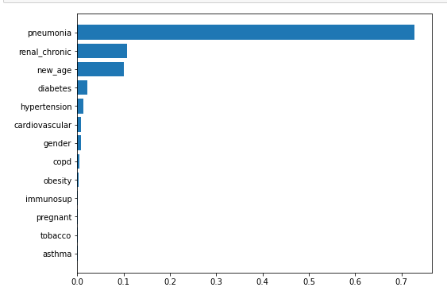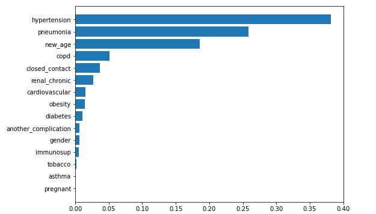  

- SMOTE
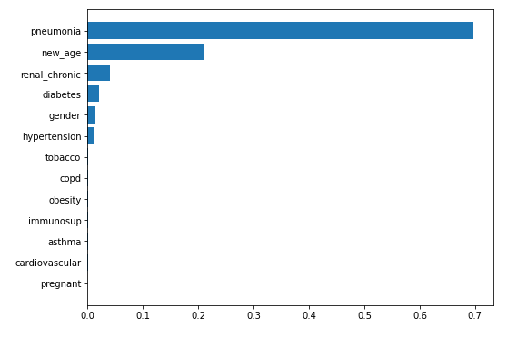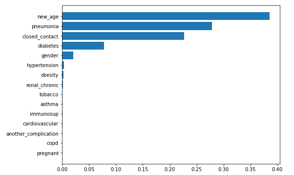

### 'ICU' as Target
- SMOTEENN
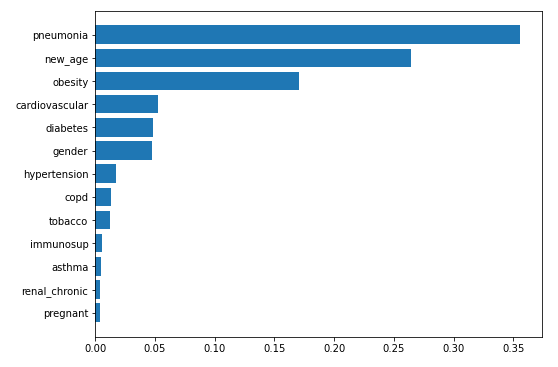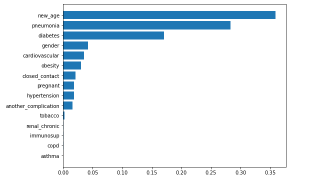

- SMOTE
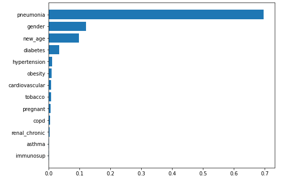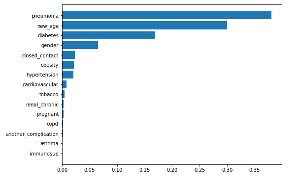

### 'Intubation' as Target
- SMOTEENN
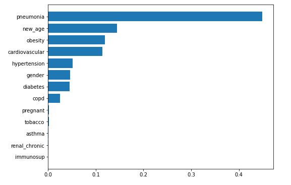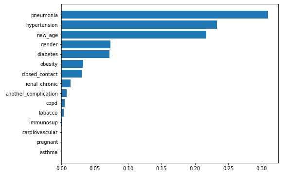

- SMOTE
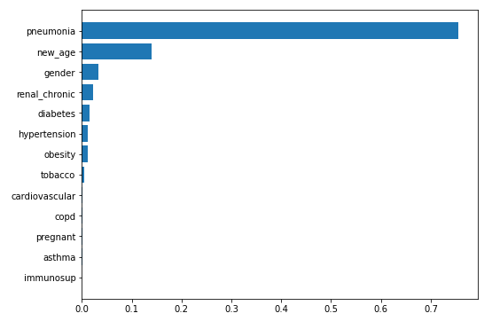

## Target_Resampling_Model Comparison
Here's an overview of balanced accuracy score and false negative cases under each combination.
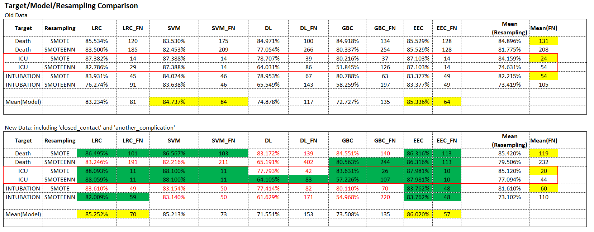
