# Machine Learning Analysis Summary

## Overview and Purpose
As Mexico is listed in the top 5 countries with the most COVID death rate , we are going to look into the factors that may be significantly relevant to death, based on which we would like to classify the high risks group and the low risk groups in face with COVID.

 At the end of the analysis, we are planning to use the machine learning model to provide the initial screening of the patients who are potentially infected with COVID, and classify them into high risk or low risk group for further diagnosis and treatment.

## Hypothesis and Data Preprocessing 
Given the purpose of the analysis, we found the COVID patient data for the machine learning model, released by [**Mexico Government**](https://datosabiertos.salud.gob.mx/gobmx/salud/datos_abiertos/datos_abiertos_covid19.zip), which includes basic info of patients, as well as the status of underlying medical conditions, hospitalization status and deceased info. 

  The hypothesis is that, patients who have medical underlying conditions are more likely to be faced with severe situation, even death from COVID infection, and are supposed to be classified as high risk group of COVID.

 A glance of columns, data types and initial data preprocessing decision as follows:
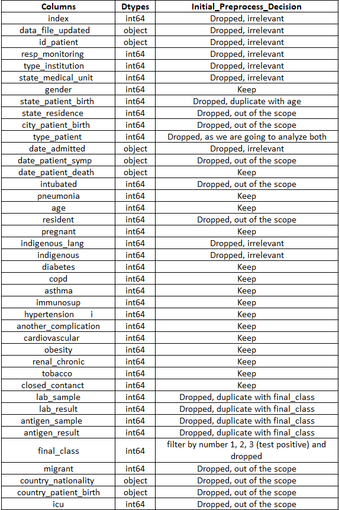

 As the end goal is to create a Machine Learning model and make predications of high/low risk groups of COVID, we are going to focus on the data: 

- Whose COVID results were positive
- Whose columns show the medical underlying conditions, age, gender that may be significantly relevant to the result 'Death'
- Other info which may help with the prediction, such as ['closed_contact'] and ['other_complication'].

 After the initial preprocesing, We dropped couple irrelevant and duplicate info columns and advance into the second stage of the preprocessing -- <strong>regroup and data cleaning</strong>.

 We further regroup and clean the remaining columns to address following issues:

- ['date_patient_death'] is further categorized and labeled as '0' for 'alive', '1' for 'deceased' based on the date input
- ['age'] is regrouped and labeled from 1 to 5. The regrouped age category indicates below:
    - Child(0-16) : 1
    - Young_Adults(17-32) : 2
    - Middle_age_Adults(33-48) : 3
    - Old_age_Adults(49-64) : 4
    - Senior_Adults(65-90) : 5
* We also analyzed the ['age'] column and get the 1st Quartile,median, and 3rd Quartile. Based on the definition of Outlier, age above 91 is considered outlier. We further dropped the outliers.
- Rest of the columns are showing the categorical integer. We further regroup the category ['Unknown'] or ['N/A'] to ['No'], so that each medical conditions or features have clean input - Yes and No. 

## Preliminary Feature Engineering and Feature Selection
After the data preprocessing, we are having an all-integer full datasets, with each input as categorical numeric. We are clear that ['Death'] is going to be the target. We would like to decide on the features that will be used to fit into the model. 

### Statistical Analysis for Underlying Medical Conditions using R Language 
As both the target and potential features are categorical numeric, we are using Chi-squared test and logistic Regression in R to validate if the underlying medical conditions are significantly relevant to the target ['Death']. The result shows almost all the medical conditions, as well as age(Adults and senior people) are significantly relative to the target ['Death'] based on the clean patient data(P value is smaller than 0.05), except the condition - ['pregnant'] and ['cardiovascular']. The result as follows:
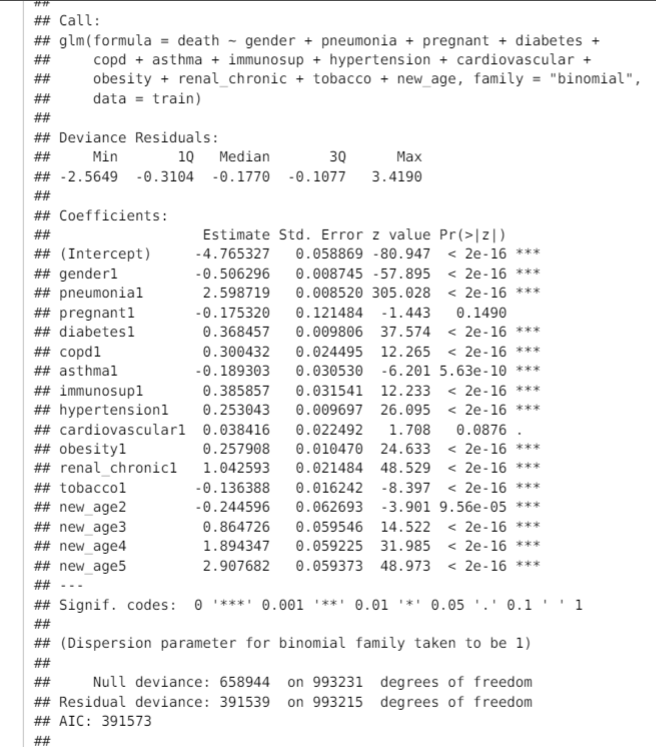
  So preliminarily, the features are relevant to the target. Even though ['pregnant'] and ['cardiovascular'] didn't appear significant to the target ['Death'], we are still going to proceed with them as they would be valuable info for the doctors to prepare further diagnosis and treatment.
    
### Wrapper Feature Selection
    
In order to make sure that our machine learning algorithms is not misled by irrelevant input features, the RFE algorithm (Recursive Feature Elimination) is employed to eliminate them. RFE take number of features to select as hyperparameter, so we test different numbers of features using the decision tree model. Performance increased as the number of features increased, but reached a limit after seven features. The below graph shows Box Plot of RFE Number of Selected Features vs. Classification Accuracy.
   
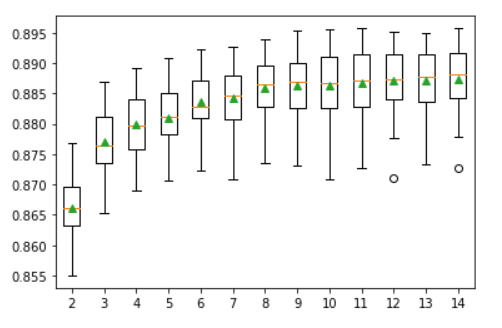
    
Additionally, RFE can automatically select the number of features by performing cross-validation evaluations of different numbers of features and selecting the number of features with the best mean score. Based on the results, the most relevant features are: "gender", "pneumonia", "diabetes", "hypertension", "obesity", "closed_contact", "age".
    

    
Despite removing the irrelevant features, the performance of our final model is not improving (accuracy is 86.3% vs 86.5%), so we decide to keep them all. 

## Machine Learning Analysis
After data preprocessing and preliminary feature engineering, we are ready to fit the data into the machine learning models. 
  As we figure, the class of '1' accounts for only 11% of the entire dataset, we are focusing on the techiniques and models that can handle the impact of the imbalanced dataset well.

  Here's the scope of the machine learning analysis:
  We are trying to compare the balanced accuracy score and false negative cases in the combination of following parameters:

- Targets: ['DEATH']
- Features: ['gender','pneumonia', 'new_age','pregnant', 'diabetes', 'copd','asthma', 'immunosup', 'hypertension','cardiovascular', 'obesity', 'renal_chronic', 'tobacco', 'another_complication','closed_contact']
- Resampling: SMOTE, SMOTEENN, Undersampling
- Machine Learning models: 
    - Logistic Regression Classifier
    - Support Vector Machines (SVM)
    - Gradient Boosting Classifier
    - Decision Tree Classifier
    - Random Forest Classifier
    - Balanced Random Forest Classifier
    - Easy Ensemble Classifier

### Initial Cross Validation and Metrics 
Based on the listed models above, we did 2 different kinds of cross validation - <strong>K fold and StratifiedKFold</strong> using a sample of the full datasets(at least 30,000 rows of data).
  Given the use case of the project, we are hoping to screening the people, who are potentially infected with COVID and have these medical conditions. We would rather be more agreesive in classfying patients rather than miss any potential high risk patient. So <strong>recall</strong> of high risk class is the metrics we are focusing on.  
  To address the imbalanced distribution of the '1' class, we evaluated the models with different <strong>resampling techniques</strong>: SMOTE, SMOTEENN, Undersampling, as well as with standard scaling and without. 
  Here's an overview of the K-fold(n_splits=10) cross validation results showing the <strong>recall</strong> of different models(Using sample data with 30,000 rows): 
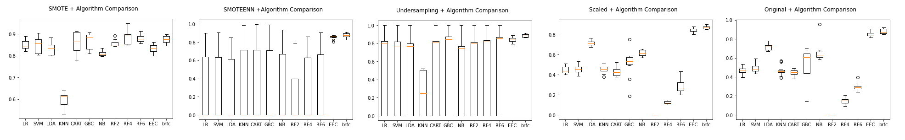
  As we can see, both SMOTE and Undersampling performed well across all models. Undersampling tends to have more standard errors in the performance during k-fold cross validation. With SMOTE, more time was spent on running the models.
  One thing that worths mentioning is that the Easy Ensemble Classifier and Balanced Random Forest Classifier performances stay consistent across different resampling techniques due to natural integration of Undersampling techniques. 

### Further Validation using StratifiedKFold and Test Datasets
Furthermore, we used StratifiedKFold(n_splits = 5) across all 7 models with both SMOTE and Undersampling techniques, calculating accuracy score, balanced accuracy score, precision, recall and F1. (Using sample data with 50,000 rows)

 Here's the result of StratifiedKFold CV with SMOTE:

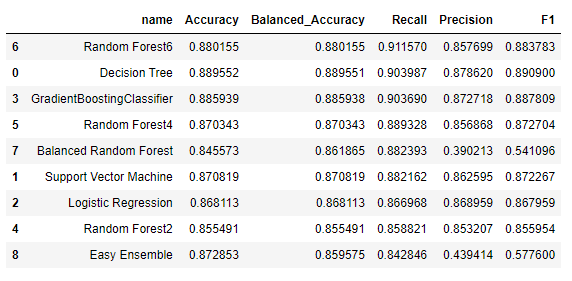

 Here's the result of StratifiedKFold CV with Undersampling:

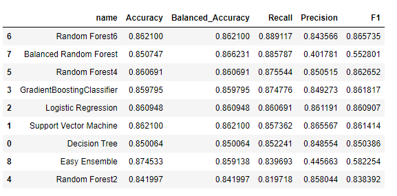

  As we split the sample dataset with 75% training data and 25% test data. We evaluated the model prediction using the test data and calculated the same metrics. 

 Here's the result of test data validation with SMOTE:

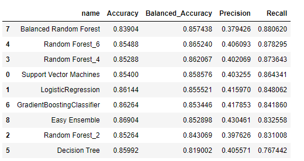

 Here's the result of test data validation with Undersampling:

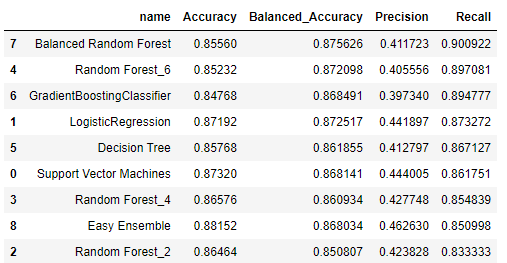

  From the result and analysis above, We can tell Balanced Random Forest, Gradient Boosting and Random forest has the best recall score and decent balanced accuracy score across both SMOTE and Undersampling approaches.

### Other experiments
  We also looked into the deep learning, and built the model with 2 hidden layers, and relu activation function. Comparing SMOTE and Undersampling techniques, we tested 50,000 rows of sample data and calculated accuracy score, TruePostivies, FalseNegatives and Recall. 
  Here's the result with SMOTE:

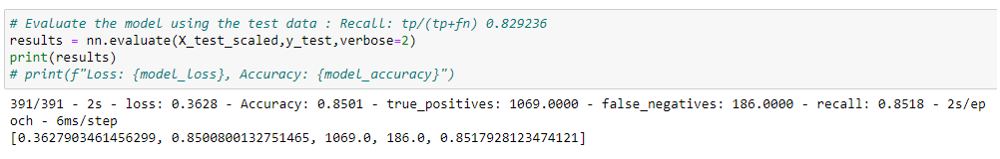

  Here's the result with Undersampling:

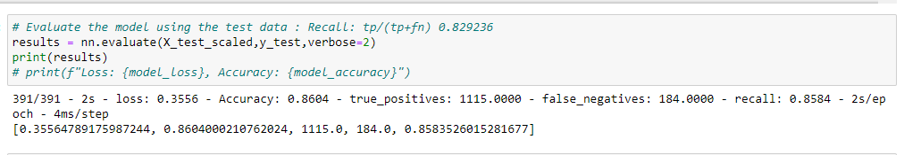

  The result stays similar as the rest of the models.

### Conclusion
After cross validation and test data validation on the Machine Learning and Deep Learning models, we can tell Balanced Random Forest, Gradient Boosting and Random Forest give us the best Recall and Balanced Accuracy score. 
  However, we noticed with SMOTE, the time spent on running the model is significantly more than the Undersampling method. In addition, in the real world, it would be more straightforward without manipulating the input data before running into the model. 
  Considering the computational and process efficiency, along with the Recall score and balanced accuracy score of the models, we decided to use the <strong>Balanced Random Forest</strong>, which naturally integrates with the Undersampling process, as our prediction model.

* Full dataset validation
  Finally, we ran the full datasets(more than 1.4millions rows of data) into the Balanced Random Forest Classifier, and got the <strong>88% of recall and 86.57% of the balanced accuracy score within 2 mins</strong>.

* Feature importances
  The feature importance from the Balanced Random Forest Classifier shows below, which aligns with our statistical analysis using R in preliminary feature engineering.
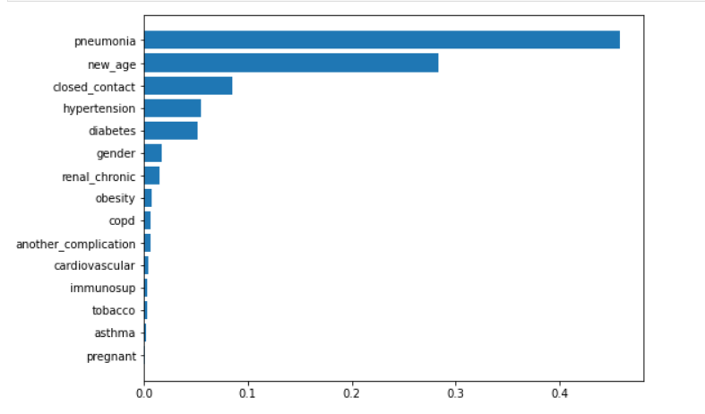

