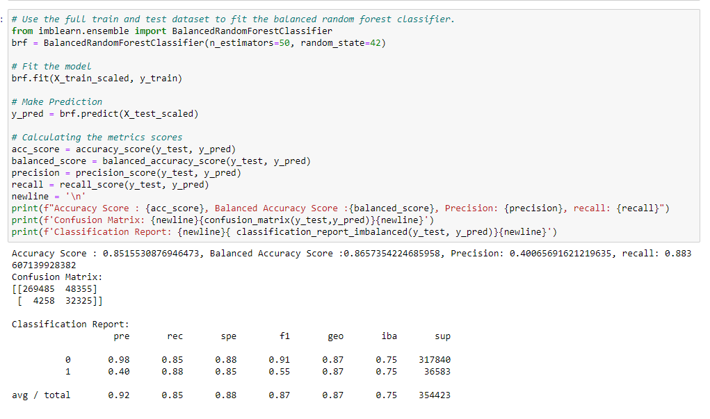

# Machine Learning Analysis Summary 

## Overview and Purpose 

As Mexico is listed in the top 5 countries with the most COVID death rate , we are going to look into the factors that may be significantly relevant to death, based on which we would like to classify the high risks group and the low risk groups in face with COVID. 

 At the end of the analysis, we are planning to use the machine learning model to provide the initial screening of the patients who are infected with COVID, and classify them into high risk or low risk group for further diagnosis and treatment. 

## Hypothesis and Data Preprocessing  

Data Source of this Machine Learning Analysis: COVID patient data released by [**Mexico Government**](https://datosabiertos.salud.gob.mx/gobmx/salud/datos_abiertos/datos_abiertos_covid19.zip), which includes basic info of patients, as well as the status of underlying medical conditions, hospitalization status and deceased info. The main analysis is based on 3.5 million rows of data, a sample of the full database. 

  The hypothesis is that, patients who have medical underlying conditions are more likely to run into severe situation, even death from COVID infection, and are supposed to be classified as high risk group of COVID. 

 A glance of columns, data types and initial data preprocessing decision as follows: 

 

 As the end goal is to create a Machine Learning model and make predications of high/low risk groups of COVID, we are going to focus on the data:  

- Whose COVID results were positive 

- Whose columns show the medical underlying conditions, age, gender that may be significantly relevant to the result 'Death' 

- Other info which may help with the prediction, such as ['closed_contact'] and ['other_complication']. 

 After the initial preprocessing, We dropped couple irrelevant and duplicate info columns and advance into the second stage of the preprocessing -- <strong>regroup and data cleaning</strong> -- to address following issues: 

- Encoded target: ['date_patient_death'] and rest of the feature columns (categorical integer) into '0' for 'alive'/'No', '1' for 'deceased'/'Yes' based on the current date input 

- ['age'] is regrouped and labeled from 1 to 5. The regrouped age category indicates below: 

    - Child(0-16) : 1 
    - Young_Adults(17-32) : 2 
    - Middle_age_Adults(33-48) : 3 
    - Old_age_Adults(49-64) : 4 
    - Senior_Adults(65-90) : 5 

* We also analyzed the ['age'] column and dropped the outliers (age above 91 is considered outlier) 

- Rest of the columns are showing the categorical integer. We further regroup the category ['Unknown'] or ['N/A'] to ['No'], so that each medical conditions or features have clean input - Yes and No.  

## Preliminary Feature Engineering and Feature Selection 

After the data preprocessing, we are having a clean data with each input as categorical integer. We are clear that ['Death'] is going to be the target. We would like to decide on the features that will be used to fit into the model.  

### Statistical Analysis for Underlying Medical Conditions using R Language  

As both the target and potential features are categorical integer, we are using Chi-squared test and logistic Regression in R to validate if the underlying medical conditions are significantly relevant to the target ['Death']. The result shows almost all the medical conditions, as well as age(Adults and senior people) are significantly relevant to the target ['Death'] based on the clean patient data(P value is smaller than 0.05), except the condition - ['pregnant'] and ['cardiovascular']. The result as follows: 

 

  So preliminarily, the features selected are relevant to the target. Even though ['pregnant'] and ['cardiovascular'] didn't appear significant to the target ['Death'], we are still going to proceed with them as they would be valuable info for the doctors to prepare further diagnosis and treatment. 

### Wrapper Feature Selection 

In order to make sure that our machine learning algorithms is not misled by irrelevant input features, the RFE algorithm (Recursive Feature Elimination) is employed to eliminate them. RFE take number of features to select as hyperparameter, so we test different numbers of features using the decision tree model. Performance increased as the number of features increased, but reached a limit after seven features. The below graph shows Box Plot of RFE Number of Selected Features vs. Classification Accuracy. 

 

Additionally, RFE can automatically select the number of features by performing cross-validation evaluations of different numbers of features and selecting the number of features with the best mean score. Based on the results, the most relevant features are: "gender", "pneumonia", "diabetes", "hypertension", "obesity", "closed_contact", "age". 

 

Despite removing the irrelevant features, the performance of our final model is not improving (accuracy is 86.3% vs 86.5%), so we decide to keep them all.  

## Machine Learning Analysis 

After data preprocessing and preliminary feature engineering, we are ready to fit the data into the machine learning models.  
  As we figure, the class of '1' accounts for only 11% of the entire dataset, we are focusing on the techniques and models that can handle the impact of the imbalanced dataset well. 
  Here's the scope of the machine learning analysis: 

- Targets: ['DEATH'] 
- Features: ['gender','pneumonia', 'new_age','pregnant', 'diabetes', 'copd','asthma', 'immunosup', 'hypertension','cardiovascular', 'obesity', 'renal_chronic', 'tobacco', 'another_complication','closed_contact'] 
- Resampling: SMOTE, SMOTEENN, Undersampling 
- Machine Learning models:  
    - Logistic Regression Classifier 
    - Support Vector Machines (SVM) 
    - Gradient Boosting Classifier 
    - Decision Tree Classifier 
    - Random Forest Classifier 
    - Balanced Random Forest Classifier 
    - Easy Ensemble Classifier 

  To address the imbalanced distribution of the '1' class, we evaluated the models with different <strong>resampling techniques</strong>: SMOTE, SMOTEENN, Undersampling, in mind to boost the model performance.  
  Given the use case of the project, we would rather be more aggressive in classifying patients rather than miss any potential high risk patients. So Recall of the high risk class is the metrics we are focusing on.   

### Initial Cross Validation and Metrics  

Based on the listed models above, we did 2 different kinds of cross validation - <strong>K fold and StratifiedKFold</strong> using a sample of the entire dataset (30,000 rows of data). 
  Here's an overview of the K-fold(n_splits=10) cross validation results showing the <strong>recall</strong> of different models with different resampling methods:  

 

  As we can see, both SMOTE and Undersampling performed well across all models; While SMOTEENN was showing large amount of variance in Recall. We also noticed with SMOTE, the time spent on resampling is significantly more than the Undersampling method. Comparing with the validation without any resampling, we can confirm that resampling significantly improves the model performance. 

  One thing that is worth mentioning is that the Easy Ensemble Classifier and Balanced Random Forest Classifier performances stay consistent across different resampling techniques due to natural integration of Undersampling techniques.  

### Further Validation using StratifiedKFold and Test Datasets 

Furthermore, we increased the sample data to 50,000 rows, and used StratifiedKFold(n_splits = 5) validation and test datasets (25% of the sample data) across all 7 models with both SMOTE and Undersampling, calculating balanced accuracy score, recall, F1,etc. 
 Here's the result of StratifiedKFold CV with SMOTE: 

 
 Here's the result of StratifiedKFold CV with Undersampling: 

 

  As we split the sample dataset with 75% training data and 25% test data. We evaluated the model prediction using the test data and calculated the same metrics.  
 Here's the result of test data validation with SMOTE: 

 

 Here's the result of test data validation with Undersampling: 

 

  From the result and analysis above, We can tell Balanced Random Forest, Gradient Boosting and Random forest has the best recall score and decent balanced accuracy score across both SMOTE and Undersampling approaches. 

### Model Interpretation

To understand how the model works we used the SHAP library in Python. SHAP helps us interpret machine learning models with Shapely values. Shap values are measures of contributions each predictor (feature) has in a machine learning model. Generating explanations for a single prediction below.

The SHAP plot shows features that contribute to pushing the output from the base value (average model output) to the actual predicted value. Choosen instance refers to a senior patient. This patient suffers from pneumonia and has diabetes. The model predicted his death and we can clearely see that Pneumonia and age played the bigger factor in the prediction of his class. 

This other patient is also in the senior age group and has obesity. the model classified him in the low risk group. His age was pushing him to the high risk group but because he doesn't suffer from Pneumonia he survived. 

Based on the SHAP waterfall plot, we can say that Pneumonia is the most important feature in the model, which has more than 30% of the model's explainability. Also, these top 10 features provide more than 100% of the model's interpretation.

### Other experiments 

  We also looked into the deep learning, and built the model with 2 hidden layers, and relu activation function. Comparing SMOTE and Undersampling techniques, we tested 50,000 rows of sample data and calculated accuracy score, TruePostivies, FalseNegatives and Recall.  
  Here's the result with SMOTE: 

 
  Here's the result with Undersampling: 

 
  The result stays similar as the rest of the models. 

## Conclusion 

After cross validation and test data validation on the Machine Learning and Deep Learning models, we decided to use Balanced Random Forest as the prediction model, with following considerations: 

- Excellent Recall and balanced accuracy performance across the board 
- Natural integration of UnderSampling technique 
- Aggregation of Trees fit by randomly bootstrap samples with undersampling minimizes the variance of the model, so it stays stable across the board 
- Widely used in Healthcare industry for disease prediction based on medical history 

### Full dataset validation
Finally, we ran the full datasets(more than 1.4 million rows of data) into the Balanced Random Forest Classifier, and got the <strong>88% of recall and 86.57% of the balanced accuracy score in 1 min</strong>. 

### Feature importances 
The feature importance from the Balanced Random Forest Classifier shows below, which aligns with our statistical analysis using R in preliminary feature engineering. 

 

### Limitation and future analysis

- Computational Efficiency
  Even though Balanced Random Forest is powerful handling imbalanced dataset, it may not be the most computational efficient model. Considering we are going to fit 16 million rows of data from the entire database, and the number will grow even bigger, we will need to further evaluate the time of processing each model, as well as the storage space each model requires.
  We can further break down the time evaluation into 'training time' and 'prediction time' to provide detailed information for different application needs.

- Parameters and Feature Optimization
  Further fine tune the parameters of the most efficient models using GridSearchCV for potential performance boost.
  We can also try another machine learning analysis using different preprocessing method on the features, such as ['age'] and see if that will change the result.

 

 

 

 

 

 

 
